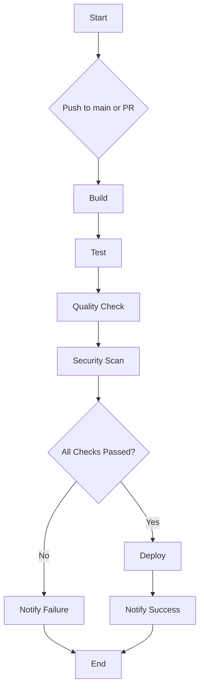

# CI/CD Pipeline Architecture

This document outlines the architecture of the CI/CD pipeline for this project.

## Pipeline Architecture Diagram

## Pipeline Stages

### 1. Build
- **Trigger:** A push to the `main` branch or a pull request targeting `main`.
- **Runner:** A GitHub Actions runner with a Node.js environment.
- **Steps:**
    1. Checkout the code.
    2. Install dependencies using `npm install`.
    3. Cache `node_modules` to speed up subsequent builds.
    4. Run the build script `npm run build`.
    5. Archive the build artifacts.
- **Output:** A distributable application package.

### 2. Test
- **Trigger:** After a successful build.
- **Steps:**
    1. Restore build artifacts.
    2. Run unit tests using `npm test`.
    3. Run integration tests.
    4. Generate a test report and code coverage report.
- **Output:** `test-report.xml` and `coverage.html`.

### 3. Quality Check
- **Trigger:** After successful tests.
- **Steps:**
    1. Run ESLint to check for code style issues.
    2. Analyze code with SonarQube for code quality and complexity.
- **Quality Gates:**
    - Test coverage must be >= 80%.
    - No critical or blocker issues reported by SonarQube.
    - Linting must pass with no errors.
- **Output:** Quality analysis report.

### 4. Security Scan
- **Trigger:** After a successful quality check.
- **Steps:**
    1. Scan dependencies for known vulnerabilities using Snyk.
    2. Scan the container image for vulnerabilities using Trivy.
- **Output:** `security-scan-report.json`.

### 5. Deploy
- **Trigger:** After all previous stages pass successfully on the `main` branch.
- **Steps:**
    1. Deploy the application to the staging environment.
    2. Run smoke tests on the staging environment.
    3. If smoke tests pass, deploy to the production environment.
- **Rollback:** In case of deployment failure, the previous stable version will be automatically redeployed.
- **Output:** Deployment success or failure report.

## Notifications and Reports
- **Success:** A notification will be sent to the team's Slack channel upon successful deployment.
- **Failure:** If any stage fails, a notification with a link to the failed pipeline run will be sent to the team's Slack channel.
- **Reports:** All reports (test, coverage, security) will be stored as artifacts in the pipeline run.
